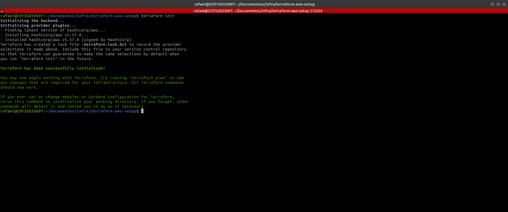
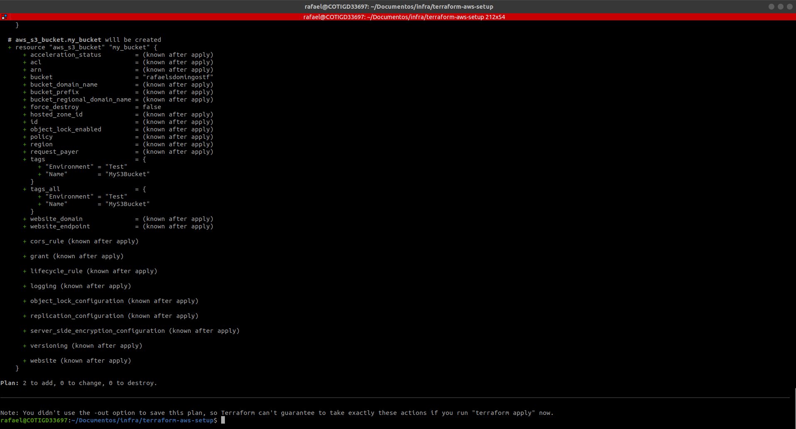
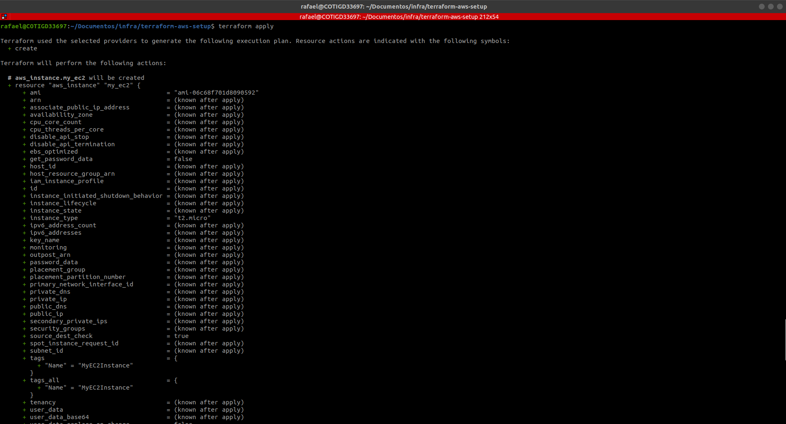
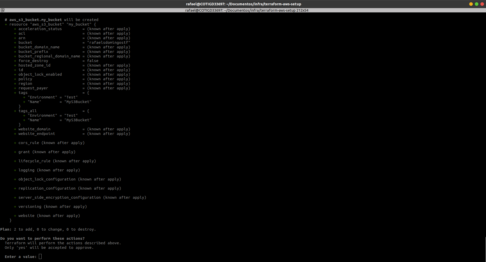
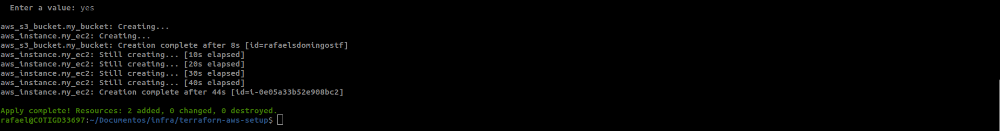
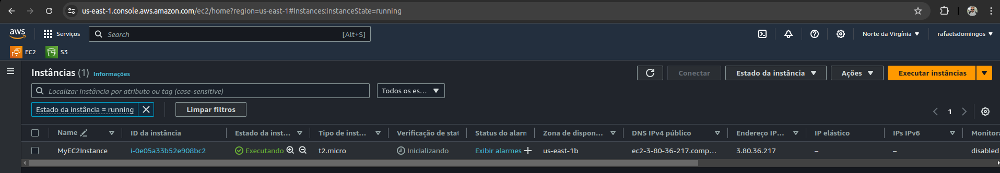
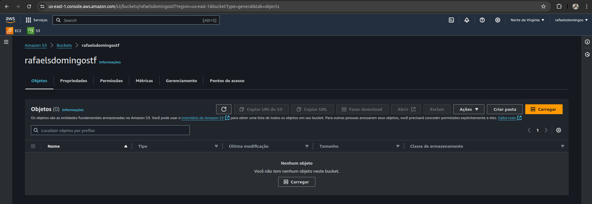

# terraform-aws-setup

Atividade do curso de instalação e configuração do Terraform para subir uma instância EC2 e um buncket S3 no Amazon AWS.

## Prints da atividade

### terraform init

### terraform plan

### terraform apply

### Amazon AWS EC2

### Amazon AWS S3
